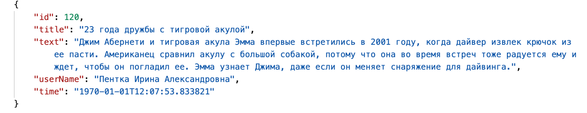

== Таблица 1.1 Методы

|===
|№ |request|responce

|1
|get something
|receive something

|2
|post something
|receive something

|3
|patch something
|receive something

|===
==== Заголовок
`что это такое`

#это что-то интересное#

[.line-through]#очень интересное#

 ля-ля

ля-ля-фа-соль